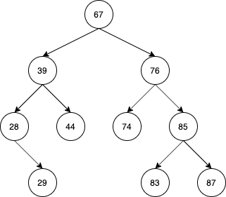

# Masivian - Binary Tree

This is a SpringBoot Application and creates a binary tree or find the lowest common ancestor between two nodes.

## Installation and run

Download the code from this repository and import it into your favorite IDE as a maven project. 

You should install Lombok plugin to compile the project although not necessary for run the application.

You can build the project with this command:

```bash
mvn clean install
```
Then you can run it.

### Endpoints

The application exposes 3 endpoints:
+ _/health:_This endpoint is used to verify the status of the application.
+ _/binaryTree/create:_ This endpoint creates the binary tree. It receives as parameter a request object with an array of integer called `values`.
+ _/binaryTree/findLCA:_ This endpoint finds the lowest common ancestor between two nodes. It receives as parameter a binary tree and the two nodes.

These endpoints are available in Swagger for an easier execution (_/swagger-ui.html_).

### Request examples

+ _/binaryTree/create_
```json
{
    "values":[67,39,76,74,28,85,44,29,87,83]
}
```

+ _/binaryTree/findLCA_
```json
{
	"binaryTree": {
	    "root": {
	        "index": 67,
	        "leftChild": {
	            "index": 39,
	            "leftChild": {
	                "index": 28,
	                "rightChild": {
	                    "index": 29
	                }
	            },
	            "rightChild": {
	                "index": 44
	            }
	        },
	        "rightChild": {
	            "index": 76,
	            "leftChild": {
	                "index": 74
	            },
	            "rightChild": {
	                "index": 85,
	                "leftChild": {
	                    "index": 83
	                },
	                "rightChild": {
	                    "index": 87
	                }
	            }
	        }
	    }
	},
	"firstNode":76,
	"secondNode":28
}
```
This request represents the follow binary tree:

